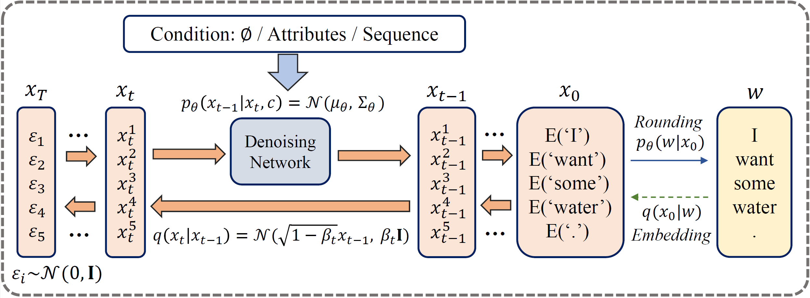
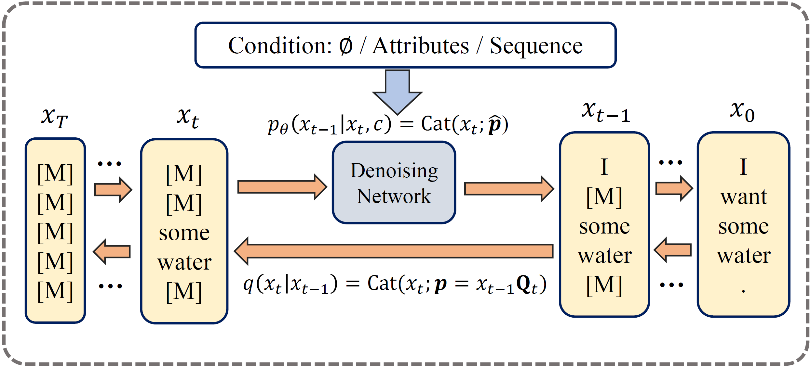

# Awesome-Text-Diffusion-Models

> A collection of papers related to text diffusion models.
>
> The organization of papers refer to our survey  ['Diffusion Models for Non-autoregressive Text Generation: A Survey'](https://arxiv.org/abs/2303.06574) , which is accepted by IJCAI 2023 survey track.
>
> If you find our survey useful for your research, please cite the following paper:

```
@article{li2023diffusion,
  title={Diffusion Models for Non-autoregressive Text Generation: A Survey},
  author={Li, Yifan and Zhou, Kun and Zhao, Wayne Xin and Wen, Ji-Rong},
  journal={arXiv preprint arXiv:2303.06574},
  year={2023}
}
```

## Continuous Text Diffusion Model



1. **Argmax Flows and Multinomial Diffusion: Learning Categorical Distributions** *Emiel Hoogeboom et al.* NeurIPS 2021.

   [[Paper](https://arxiv.org/abs/2102.05379)]

2. **Diffusion-LM Improves Controllable Text Generation** *Xiang Lisa Li et al.* NeurIPS 2022.

   [[Paper](https://arxiv.org/abs/2205.14217)] [[Code](https://github.com/XiangLi1999/Diffusion-LM)] 

3. **Composable Text Controls in Latent Space with ODEs** *Guangyi Liu et al.* arxiv 2022.

   [[Paper](https://arxiv.org/abs/2208.00638)] [[Code](https://github.com/guangyliu/LatentOps)] 

4. **DiffuSeq: Sequence to Sequence Text Generation with Diffusion Models** *Shansan Gong et al.* ICLR 2023.

   [[Paper](https://arxiv.org/abs/2210.08933)] [[Code](https://github.com/Shark-NLP/DiffuSeq)] 

5. **SSD-LM: Semi-autoregressive Simplex-based Diffusion Language Model for Text Generation and Modular Control** *Xiaochuang Han et al.* arxiv 2022.

   [[Paper](https://arxiv.org/abs/2210.17432)] [[Code](https://github.com/xhan77/ssd-lm)] 

6. **Self-conditioned Embedding Diffusion for Text Generation** *Robin Strudel et al.* arxiv 2022.

   [[Paper](https://arxiv.org/abs/2211.04236)] 

7. **Continuous diffusion for categorical data** *Sander Dieleman et al.* arxiv 2022.

   [[Paper](https://arxiv.org/abs/2211.15089)] 

8. **Difformer: Empowering Diffusion Model on Embedding Space for Text Generation** *Zhujin Gao et al.* arxiv 2022.

   [[Paper](https://arxiv.org/abs/2212.09412)] 

9. **Latent Diffusion for Language Generation** *Justin Lovelace et al.* arxiv 2022.

   [[Paper](https://arxiv.org/pdf/2212.09462)] [[Code](https://github.com/justinlovelace/latent-diffusion-for-language)] 

10. **SeqDiffuSeq: Text Diffusion with Encoder-Decoder Transformers** *Hongyi Yuan et al.* arxiv 2022.

    [[Paper](https://arxiv.org/abs/2212.10325)] [[Code](https://github.com/Yuanhy1997/SeqDiffuSeq)] 

11. **Text Generation with Diffusion Language Models: A Pre-training Approach with Continuous Paragraph Denoise** *Zhenghao Lin et al.* arxiv 2022.

    [[Paper](https://arxiv.org/abs/2212.11685)] [[Code](https://github.com/microsoft/ProphetNet/tree/master/GENIE)] 

12. **A Reparameterized Discrete Diffusion Model for Text Generation** *Lin Zheng et al.* arxiv 2023.

    [[Paper](https://arxiv.org/abs/2302.05737)] [[Code](https://github.com/HKUNLP/reparam-discrete-diffusion)] 

13. **DINOISER: Diffused Conditional Sequence Learning by Manipulating Noises** *Jiasheng Ye et al.* arxiv 2023

    [[Paper](https://arxiv.org/abs/2302.10025)] [[Code](https://github.com/yegcjs/DINOISER)] 

14. **GlyphDiffusion: Text Generation as Image Generation** *Junyi Li et al.* arxiv 2023

    [[Paper](https://arxiv.org/abs/2304.12519)] 

## Discrete Text Diffusion Models



1. **Structured Denoising Diffusion Models in Discrete State-Spaces** *Jacob Austin et al.* NeurIPS 2021.

   [[Paper](https://arxiv.org/abs/2107.03006)] 

2. **DiffusionBERT: Improving Generative Masked Language Models with Diffusion Models** *Zhengfu He et al.* arXiv 2022.

   [[Paper](https://arxiv.org/abs/2211.15029)] [[Code](https://github.com/Hzfinfdu/Diffusion-BERT)] 

3. **Diff-Glat: Diffusion Glancing Transformer for Parallel Sequence to Sequence Learning** *Lihua Qian et al.* arxiv 2022.

   [[Paper](https://arxiv.org/abs/2212.10240)] 

4. **Diffusion-NAT: Self-Prompting Discrete Diffusion for Non-Autoregressive Text Generation** *Kun Zhou et al.* arxiv 2023.

   